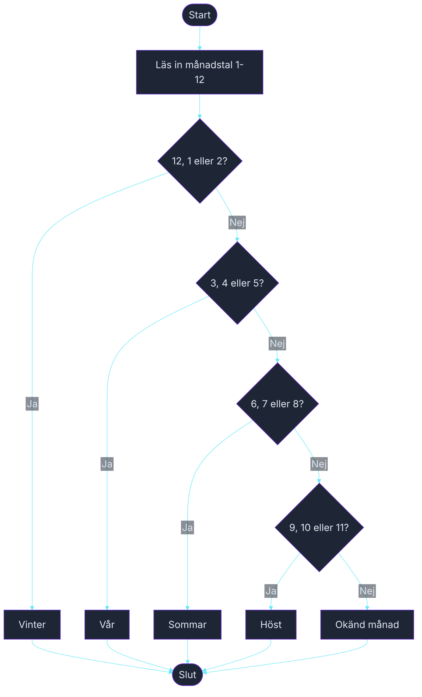

# Övning — Årstiden

> 🗺️ **Rita ett flödesschema innan du kodar.** Skissa upp programflödet på papper — vilka steg tas? Vilka beslut fattas? Rita klart, lägg ner pennan, öppna sedan VS Code.

🟢

En väderapp på telefonen visar bara månadstal — 1 till 12. Din kollega vill ha en snabb funktion som slår upp årstid baserat på månaden, för att visa rätt bakgrundsbild i appen.

---

## Steg 1: Slå upp årstiden

Läs in ett månadstal (1–12). Använd `switch` med grupperade `case`-grenar för att skriva ut rätt årstid. Kom ihåg `default` för ogiltiga värden.

Gruppering:
- December, januari, februari → Vinter
- Mars, april, maj → Vår
- Juni, juli, augusti → Sommar
- September, oktober, november → Höst

### Förväntad output
```plaintext
Ange månadstal (1-12): 7
Juli tillhör: Sommar

Ange månadstal (1-12): 11
November tillhör: Höst

Ange månadstal (1-12): 99
Okänd månad.
```

Obs: Du behöver inte skriva ut månadsnamnet — det räcker med siffran och årstiden.

## Tips

- Gruppera månader med `case 12: case 1: case 2:` osv. — alla delar samma `Console.WriteLine`.
- Kom ihåg `default` för att hantera felaktiga värden som 0 eller 13.
- `int manad = int.Parse(Console.ReadLine());`

<details><summary>Flödesschema — förslag</summary>



<!-- mermaid: diagrams/arstiden_1.mmd -->

</details>

<details><summary>Lösningsförslag</summary>

```csharp
Console.Write("Ange månadstal (1-12): ");
int manad = int.Parse(Console.ReadLine());

string manadsNamn = manad switch
{
    1 => "Januari", 2 => "Februari", 3 => "Mars", 4 => "April",
    5 => "Maj", 6 => "Juni", 7 => "Juli", 8 => "Augusti",
    9 => "September", 10 => "Oktober", 11 => "November", 12 => "December",
    _ => ""
};

switch (manad)
{
    case 12: case 1: case 2:
        Console.WriteLine($"{manadsNamn} tillhör: Vinter");
        break;
    case 3: case 4: case 5:
        Console.WriteLine($"{manadsNamn} tillhör: Vår");
        break;
    case 6: case 7: case 8:
        Console.WriteLine($"{manadsNamn} tillhör: Sommar");
        break;
    case 9: case 10: case 11:
        Console.WriteLine($"{manadsNamn} tillhör: Höst");
        break;
    default:
        Console.WriteLine("Okänd månad.");
        break;
}
```

</details>
