# Övning — Betty

> 🗺️ **Rita ett flödesschema innan du kodar.** Skissa upp orsakskedjan på papper — vilka beslut leder till vilka konsekvenser? Rita klart, lägg ner pennan, öppna sedan VS Code.

🔴

En kärlekstriangel i tre akter — inspirerad av ett välkänt tonårsdrama.

Du ska modellera en händelsekedja med booleska variabler. Varje händelse beror på en tidigare. Programmet skriver ut berättelsen baserat på vad som faktiskt hände.

Ändra startvärdena och se hur hela historien förändras.

> Sitter du fast i mer än 15 minuter? Be om hjälp — det är inte ett tecken på att du inte kan, det är precis vad 15-minutersregeln är till för.

---

## Historien

> 🎵 [Lyssna på låtarna medan du kodar](https://open.spotify.com/playlist/6zwgrPSAVTaFsuj9VFm5B5)

Tre låtar på Taylor Swifts album *folklore* berättar samma historia ur tre perspektiv:

**Betty** dansar med någon på en fest. **James** ser det, hjärtat brister — och råkar tillbringa sommaren med **Augustine** istället. **Inez** ser dem tillsammans och berättar för Betty. James ångrar sig, lämnar Augustine och dyker upp vid Bettys grind för att be om förlåtelse.

Vad händer sen? Det beror på Betty.

---

## Hur man tänker med if och else

Varje händelse i kedjan har två möjliga utgångar — den inträffade, eller den gjorde det inte. `if` visar vad som hände. `else` visar vad som hände *istället*.

```csharp
if (jamesSerDem)
    Console.WriteLine("James ser dem. Hjärtat brister.");
else
    Console.WriteLine("James märker ingenting. Han har kul på festen.");
```

Läs det som: *"Om James såg dem — skriv ut det. Annars — skriv ut det andra."*

Det viktiga: `else` tar **inget eget villkor**. Den körs automatiskt när `if`-villkoret är falskt. Du behöver inte skriva `if (!jamesSerDem)` — det är precis vad `else` redan gör.

När slutet beror på **flera saker samtidigt** kombinerar du med `&&`:

```csharp
if (jamesDykerUppVidGrinden && jamesOchAugustineHookupp && bettyForlaterJames)
    Console.WriteLine("Betty tar hans hand.");
```

Alla tre måste vara sanna — annars är det inte den här utgången.

---

## Uppgiften

### Steg 1 — Deklarera orsakskedjan

```csharp
// Startpunkter — dessa kan du ändra
bool bettyDansarMedNagon  = true;
bool jamesLamnarAugustine = true;
bool bettyForlaterJames   = true;

// Konsekvenskedjan — tilldelas från andra bools
bool jamesSerDem              = bettyDansarMedNagon;
bool augustinePickarUppJames  = jamesSerDem;
bool jamesOchAugustineHookupp = augustinePickarUppJames;
bool inezSerDem               = jamesOchAugustineHookupp;
bool inezBeratterForBetty     = inezSerDem;
bool jamesDykerUppVidGrinden  = jamesLamnarAugustine;
```

### Steg 2 — Skriv ut berättelsen med if/else

Skriv en `if/else` för varje händelse. Om händelsen är `true` — skriv ut vad som hände. Om den är `false` — skriv ut vad som hände istället.

**Slutet har tre möjliga utgångar** — använd `if / else if / else`:

```
James dök upp + det fanns något att förlåta + Betty förlåter  → "Betty tar hans hand. De dansar igen."
James dök upp + det fanns något att förlåta + Betty förlåter inte → "Betty stänger grinden."
James dök upp men det fanns inget att förlåta                 → "James dyker upp. Betty ler. Det finns inget att förlåta."
James dök aldrig upp                                          → "Betty väntar vid grinden. James kommer aldrig."
```

---

## Förväntad output (alla startvariabler = true)

```plaintext
Betty dansar med någon annan på festen.
James ser dem. Hjärtat brister.
Augustine hittar James ensam utanför. "Du ser ledsen ut."
De tillbringar sommaren tillsammans — James och Augustine.
Inez ser dem. Hon kan inte hålla tyst.
Betty får reda på allt. Via Inez. Såklart.
James lämnar Augustine. Han ångrar sig.
James dyker upp vid Bettys grind. Han är nervös.
Betty tar hans hand. De dansar igen.
```

## Förväntad output (bettyForlaterJames = false)

```plaintext
...
James dyker upp vid Bettys grind. Han är nervös.
Betty stänger grinden. "Go F**k yourself James."
```

## Förväntad output (bettyDansarMedNagon = false, jamesLamnarAugustine = true)

```plaintext
Betty stannade hemma. Ingenting hände.
James märker ingenting. Han har kul på festen.
Augustine är ensam hela kvällen. Ingen att prata med.
James nobbar Augustine. Han är inte intresserad.
Inez vet ingenting. Det finns inget att berätta.
Betty anar ingenting. Livet går vidare.
James stannar kvar hos Augustine.
James dyker upp. Betty ler. Det finns inget att förlåta.
```

---

<details><summary>Tips: kedjan startar och slutar</summary>

Om `bettyDansarMedNagon` är `false` så är alla konsekvenser av den kedjan också `false` — ingen `if`-sats längre ned triggas. Det kallas kortslutning i logiken: orsaken saknas, effekten uteblir.

`jamesDykerUppVidGrinden` är en **oberoende gren** — den styrs av `jamesLamnarAugustine`, inte av `bettyDansarMedNagon`. Du kan alltså ha en Betty som stannade hemma men ändå en James som dyker upp vid grinden.

Testa! Kombinera olika startvärden och se vad som händer.

</details>

<details><summary>Tips: sista if/else if/else</summary>

```csharp
if (jamesDykerUppVidGrinden && jamesOchAugustineHookupp && bettyForlaterJames)
    Console.WriteLine("Betty tar hans hand. De dansar igen.");
else if (jamesDykerUppVidGrinden && jamesOchAugustineHookupp)
    Console.WriteLine("Betty stänger grinden. \"Go F**k yourself James.\"");
else if (jamesDykerUppVidGrinden)
    Console.WriteLine("James dyker upp. Betty ler. Det finns inget att förlåta.");
else
    Console.WriteLine("Betty väntar vid grinden. James kommer aldrig.");
```

`bettyForlaterJames` är bara relevant om `jamesOchAugustineHookupp` är sant — det finns inget att förlåta om det aldrig hände något.

```mermaid
flowchart TD
    S([Start]) --> D1

    D1{bettyDansarMedNagon?}
    D1 -->|true| N1A["Betty dansar med någon annan på festen."]
    D1 -->|false| N1B["Betty stannade hemma. Ingenting hände."]
    N1A --> D2
    N1B --> D2

    D2{jamesSerDem?}
    D2 -->|true| N2A["James ser dem. Hjärtat brister."]
    D2 -->|false| N2B["James märker ingenting. Han har kul på festen."]
    N2A --> D3
    N2B --> D3

    D3{augustinePickarUppJames?}
    D3 -->|true| N3A["Augustine hittar James ensam utanför.\n'Du ser ledsen ut.'"]
    D3 -->|false| N3B["Augustine är ensam hela kvällen.\nIngen att prata med."]
    N3A --> D4
    N3B --> D4

    D4{jamesOchAugustineHookupp?}
    D4 -->|true| N4A["De tillbringar sommaren tillsammans\n— James och Augustine."]
    D4 -->|false| N4B["James nobbar Augustine.\nHan är inte intresserad."]
    N4A --> D5
    N4B --> D5

    D5{inezSerDem?}
    D5 -->|true| N5A["Inez ser dem.\nHon kan inte hålla tyst."]
    D5 -->|false| N5B["Inez vet ingenting.\nDet finns inget att berätta."]
    N5A --> D6
    N5B --> D6

    D6{inezBeratterForBetty?}
    D6 -->|true| N6A["Betty får reda på allt. Via Inez. Såklart."]
    D6 -->|false| N6B["Betty anar ingenting. Livet går vidare."]
    N6A --> D7
    N6B --> D7

    D7{jamesLamnarAugustine?}
    D7 -->|true| N7A["James lämnar Augustine. Han ångrar sig."]
    D7 -->|false| N7B["James stannar kvar hos Augustine."]
    N7A --> D8
    N7B --> D8

    D8{jamesDykerUppVidGrinden?}
    D8 -->|true| N8A["James dyker upp vid Bettys grind.\nHan är nervös."]
    D8 -->|false| N8B["James dyker aldrig upp.\nHan är har gått vidare."]
    N8A --> D9
    N8B --> D9

    D9{"jamesDykerUppVidGrinden\n&& jamesOchAugustineHookupp\n&& bettyForlaterJames?"}
    D9 -->|true| E1["Betty tar hans hand. De dansar igen. 💃"]
    D9 -->|false| D10

    D10{"jamesDykerUppVidGrinden\n&& jamesOchAugustineHookupp?"}
    D10 -->|true| E2["Betty stänger grinden.\n'Go F**k yourself James.'"]
    D10 -->|false| D11

    D11{jamesDykerUppVidGrinden?}
    D11 -->|true| E3["James dyker upp. Betty ler.\nDet finns inget att förlåta."]
    D11 -->|false| E4["Betty väntar vid grinden.\nJames kommer aldrig."]
```

</details>

<details><summary>Flödesschema — hela berättelsen</summary>



</details>

<details><summary>Lösningsförslag</summary>

```csharp
bool bettyDansarMedNagon  = true;
bool jamesLamnarAugustine = true;
bool bettyForlaterJames   = true;

bool jamesSerDem              = bettyDansarMedNagon;
bool augustinePickarUppJames  = jamesSerDem;
bool jamesOchAugustineHookupp = augustinePickarUppJames;
bool inezSerDem               = jamesOchAugustineHookupp;
bool inezBeratterForBetty     = inezSerDem;
bool jamesDykerUppVidGrinden  = jamesLamnarAugustine;

if (bettyDansarMedNagon)
    Console.WriteLine("Betty dansar med någon annan på festen.");
else
    Console.WriteLine("Betty stannade hemma. Ingenting hände.");

if (jamesSerDem)
    Console.WriteLine("James ser dem. Hjärtat brister.");
else
    Console.WriteLine("James märker ingenting. Han har kul på festen.");

if (augustinePickarUppJames)
    Console.WriteLine("Augustine hittar James ensam utanför. \"Du ser ledsen ut.\"");
else
    Console.WriteLine("Augustine är ensam hela kvällen. Ingen att prata med.");

if (jamesOchAugustineHookupp)
    Console.WriteLine("De tillbringar sommaren tillsammans — James och Augustine.");
else
    Console.WriteLine("James nobbar Augustine. Han är inte intresserad.");

if (inezSerDem)
    Console.WriteLine("Inez ser dem. Hon kan inte hålla tyst.");
else
    Console.WriteLine("Inez vet ingenting. Det finns inget att berätta.");

if (inezBeratterForBetty)
    Console.WriteLine("Betty får reda på allt. Via Inez. Såklart.");
else
    Console.WriteLine("Betty anar ingenting. Livet går vidare.");

if (jamesLamnarAugustine)
    Console.WriteLine("James lämnar Augustine. Han ångrar sig.");
else
    Console.WriteLine("James stannar kvar hos Augustine.");

if (jamesDykerUppVidGrinden)
    Console.WriteLine("James dyker upp vid Bettys grind. Han är nervös.");
else
    Console.WriteLine("James dyker aldrig upp. Han har gått vidare.");

if (jamesDykerUppVidGrinden && jamesOchAugustineHookupp && bettyForlaterJames)
    Console.WriteLine("Betty tar hans hand. De dansar igen.");
else if (jamesDykerUppVidGrinden && jamesOchAugustineHookupp)
    Console.WriteLine("Betty stänger grinden. \"Go F**k yourself James.\"");
else if (jamesDykerUppVidGrinden)
    Console.WriteLine("James dyker upp. Betty ler. Det finns inget att förlåta.");
else
    Console.WriteLine("Betty väntar vid grinden. James kommer aldrig.");
```

</details>
