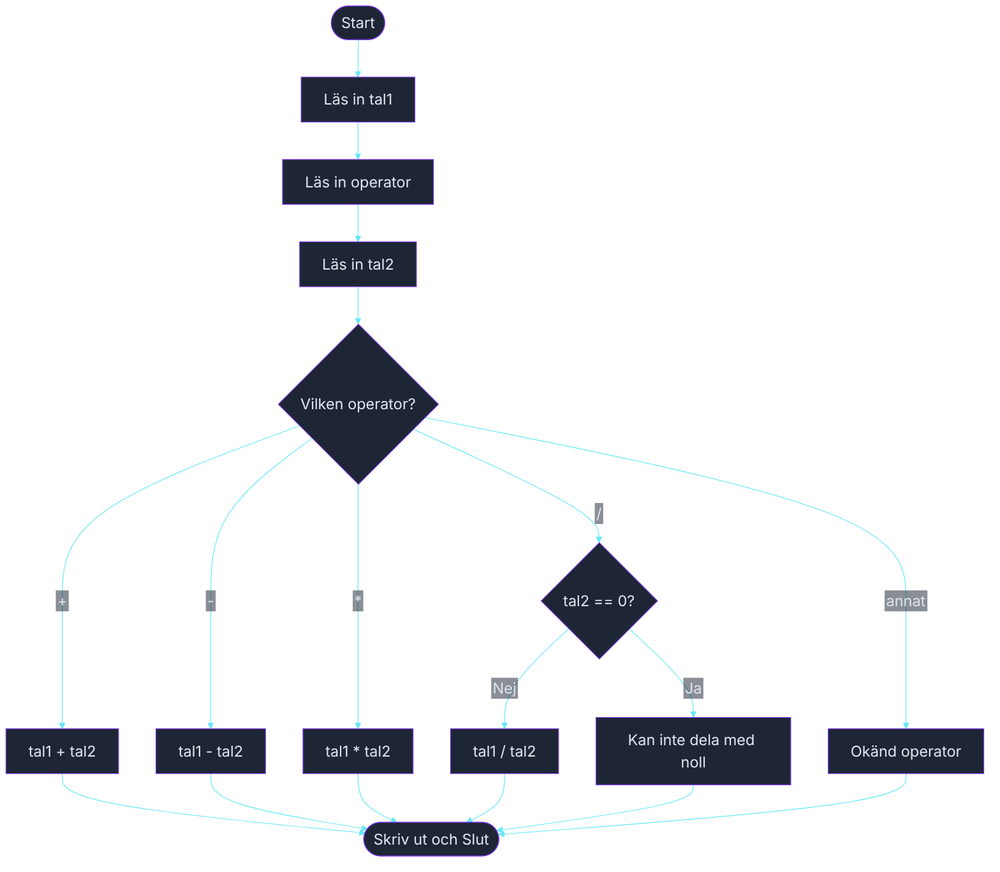

# Övning — Kalkylatorn

> 🗺️ **Rita ett flödesschema innan du kodar.** Skissa upp programflödet på papper — vilka steg tas? Vilka beslut fattas? Rita klart, lägg ner pennan, öppna sedan VS Code.

🟡

Nattväktaren på serverrummet på Klippan Data AB behöver räkna ut kapacitetsvärden snabbt — utan att ta fram telefonen. Du bygger en minimal kalkylator som körs i terminalen: mata in två tal och ett räknesätt, få svaret direkt.

---

## Steg 1: Läs in tal och operator

Läs in två decimaltal (`double`) och ett operatortecken som en `string` (+, -, *, /). Använd `switch` på operatorn för att räkna ut och skriva ut resultatet.

### Förväntad output
```plaintext
Första talet: 15
Operator (+, -, *, /): *
Andra talet: 4
Svar: 15 * 4 = 60
```

```plaintext
Första talet: 10
Operator (+, -, *, /): -
Andra talet: 3.5
Svar: 10 - 3,5 = 6,5
```

## Steg 2: Hantera division med noll

Om användaren försöker dela med noll ska programmet skriva ett vänligt felmeddelande — inte krascha.

```plaintext
Första talet: 8
Operator (+, -, *, /): /
Andra talet: 0
Kan inte dela med noll.
```

## Steg 3: Okänd operator

```plaintext
Första talet: 5
Operator (+, -, *, /): %
Andra talet: 2
Okänd operator: %
```

## Tips

- Läs in operatorn som `string op = Console.ReadLine();` och använd `switch (op)`.
- Hantera division med noll inuti `case "/":`-grenen med en `if`-sats.
- Tänk på att `double` behövs för decimaler — använd `double.Parse(Console.ReadLine())`.

<details><summary>Flödesschema — förslag</summary>



<!-- mermaid: diagrams/kalkylator_1.mmd -->

</details>

<details><summary>Lösningsförslag</summary>

```csharp
Console.Write("Första talet: ");
double tal1 = double.Parse(Console.ReadLine());

Console.Write("Operator (+, -, *, /): ");
string op = Console.ReadLine();

Console.Write("Andra talet: ");
double tal2 = double.Parse(Console.ReadLine());

switch (op)
{
    case "+":
        Console.WriteLine($"Svar: {tal1} + {tal2} = {tal1 + tal2}");
        break;
    case "-":
        Console.WriteLine($"Svar: {tal1} - {tal2} = {tal1 - tal2}");
        break;
    case "*":
        Console.WriteLine($"Svar: {tal1} * {tal2} = {tal1 * tal2}");
        break;
    case "/":
        if (tal2 == 0)
            Console.WriteLine("Kan inte dela med noll.");
        else
            Console.WriteLine($"Svar: {tal1} / {tal2} = {tal1 / tal2}");
        break;
    default:
        Console.WriteLine($"Okänd operator: {op}");
        break;
}
```

</details>
