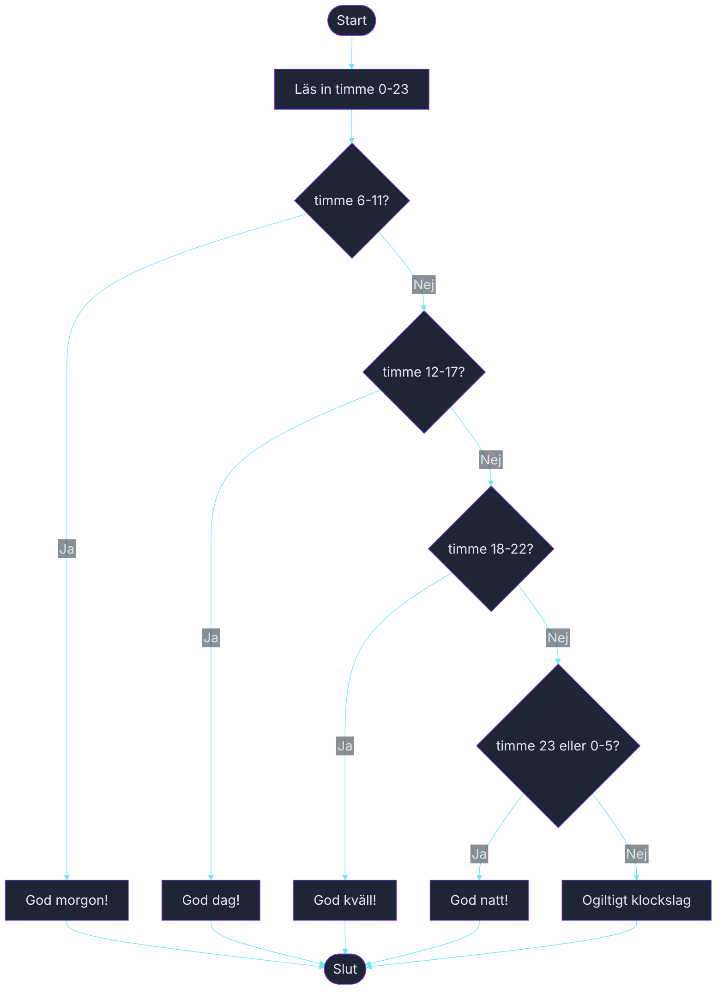

# Övning — Rätt hälsning

> 🗺️ **Rita ett flödesschema innan du kodar.** Skissa upp programflödet på papper — vilka steg tas? Vilka beslut fattas? Rita klart, lägg ner pennan, öppna sedan VS Code.

🟢

Receptionen på Hotel Riviera vill ha ett nytt check-in-system. Receptionisten ska slippa tänka på klockslaget — systemet hälsar automatiskt rätt beroende på om gästen anländer på morgonen, dagen, kvällen eller natten.

---

## Steg 1: Hälsa rätt

Läs in ett klockslag som heltal (0–23). Använd `switch` med grupperade `case`-grenar för att skriva ut rätt hälsning.

Gruppering:
- 6–11 → God morgon!
- 12–17 → God dag!
- 18–22 → God kväll!
- 23, 0–5 → God natt!

### Förväntad output
```plaintext
Ange timme (0-23): 9
God morgon!

Ange timme (0-23): 14
God dag!

Ange timme (0-23): 20
God kväll!

Ange timme (0-23): 2
God natt!
```

## Steg 2: Ogiltigt klockslag

Vad bör programmet skriva om användaren anger 24 eller -1? Lägg till ett `default`-fall.

```plaintext
Ange timme (0-23): 25
Ogiltigt klockslag.
```

## Tips

- Timmarna 23, 0–5 är "natten" men switch kan inte skriva `case 23, 0, 1, 2, 3, 4, 5:` som ett intervall — lista varje värde som ett eget `case` eller använd `default` med en extra if-sats.
- Grupperade case-grenar skrivs `case 6: case 7: case 8:` osv. på separata rader utan break emellan.
- Läs in timmen med `int timme = int.Parse(Console.ReadLine());`

<details><summary>Flödesschema — förslag</summary>



<!-- mermaid: diagrams/ratt_halsning_1.mmd -->

</details>

<details><summary>Lösningsförslag</summary>

```csharp
Console.Write("Ange timme (0-23): ");
int timme = int.Parse(Console.ReadLine());

switch (timme)
{
    case 6: case 7: case 8: case 9: case 10: case 11:
        Console.WriteLine("God morgon!");
        break;
    case 12: case 13: case 14: case 15: case 16: case 17:
        Console.WriteLine("God dag!");
        break;
    case 18: case 19: case 20: case 21: case 22:
        Console.WriteLine("God kväll!");
        break;
    case 23: case 0: case 1: case 2: case 3: case 4: case 5:
        Console.WriteLine("God natt!");
        break;
    default:
        Console.WriteLine("Ogiltigt klockslag.");
        break;
}
```

</details>
