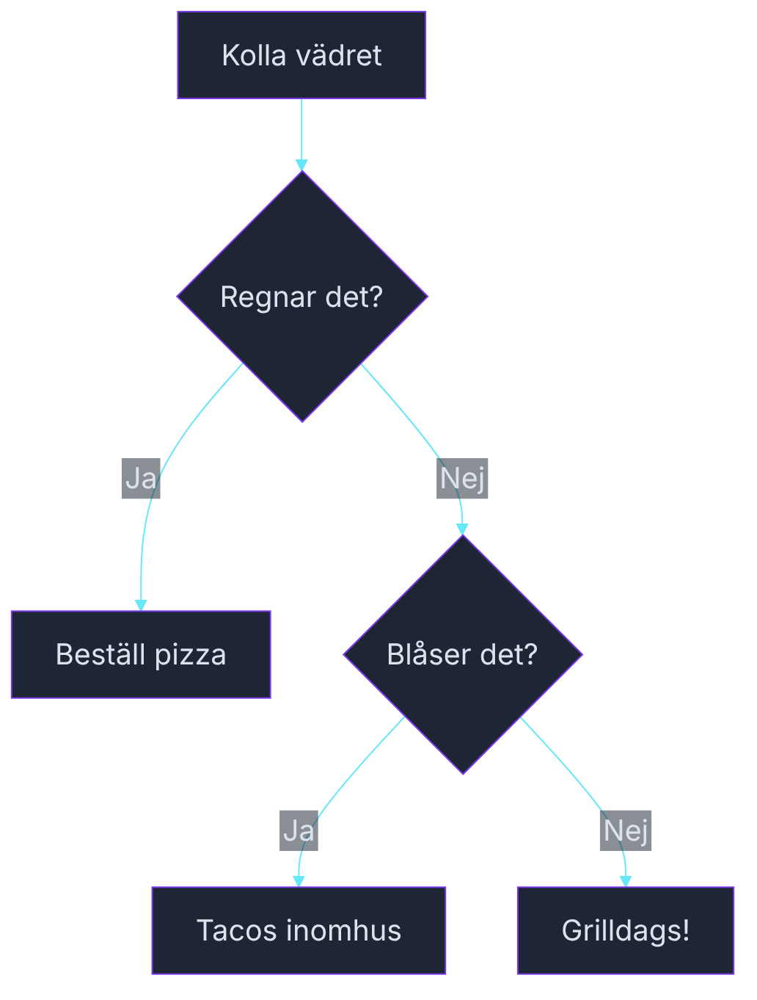

# Övning — Ska vi grilla?

> 🗺️ **Rita ett flödesschema innan du kodar.** Skissa upp programflödet på papper — vilka steg tas? Vilka beslut fattas? Rita klart, lägg ner pennan, öppna sedan VS Code.

Det är fredag och du ska bestämma vad ni ska äta ikväll. Allt beror på vädret.

| Väder | Mat |
|-------|-----|
| Regnar | Pizza (beställ hem) |
| Blåser (men inte regnar) | Tacos (inomhus) |
| Soligt och lugnt | Grill! |

---

## Flödesschema



<!-- mermaid: diagrams/ska_vi_grilla_1.mmd -->

## Kodning

---

## Steg 1: Variabler och beslut

```csharp
bool regnar = false;
bool blåser = true;
```

Skriv en `if / else if / else` som skriver ut vad ni ska äta.

### Förväntad output (regnar=false, blåser=true)
```plaintext
Vädret: blåser
Ikväll äter vi: Tacos inomhus
```

<details><summary>Hur skriver jag if med bool?</summary>

```csharp
if (regnar)
{
    // regnar är true
}
else if (blåser)
{
    // blåser är true (men regnar är false)
}
else
{
    // varken regnar eller blåser
}
```

Du behöver inte skriva `if (regnar == true)` — `if (regnar)` är identiskt och mer idiomatisk.

</details>

---

## Steg 2: Beskriv vädret

Skriv ut en rad som beskriver vädret baserat på variablerna.

- `regnar = true` → "Vädret: regnar"
- `blåser = true, regnar = false` → "Vädret: blåser"
- Båda false → "Vädret: soligt och lugnt"

---

## Steg 3: Testa alla kombinationer

Kör koden med alla fyra kombinationer och verifiera output:

| regnar | blåser | Förväntat |
|--------|--------|-----------|
| true | true | Pizza (regn trumfar allt) |
| true | false | Pizza |
| false | true | Tacos |
| false | false | Grilldags! |

<details><summary>Varför trumfar regn?</summary>

Ordningen i if-kedjan avgör. Om `regnar` är sant är det pizza — oavsett om det blåser. Det är ett medvetet designbeslut. I kod kallas det **prioritetsordning i villkorslogik**.

</details>

---

## Steg 4: Temperatur

Nu lägger vi till en extra variabel:

```csharp
int temperatur = 22;
```

Lägg till ett extra villkor: om det är soligt men under 15 grader → "Soppa hemma, det är för kallt att grilla".

<details><summary>Lösningsförslag</summary>

```csharp
bool regnar = false;
bool blåser = false;
int temperatur = 22;

string väder;
string mat;

if (regnar)
{
    väder = "regnar";
    mat = "Pizza (beställ hem)";
}
else if (blåser)
{
    väder = "blåser";
    mat = "Tacos inomhus";
}
else if (temperatur < 15)
{
    väder = "kallt men klart";
    mat = "Soppa hemma — för kallt att grilla";
}
else
{
    väder = "soligt och lugnt";
    mat = "Grilldags!";
}

Console.WriteLine($"Vädret: {väder}");
Console.WriteLine($"Ikväll äter vi: {mat}");
```

</details>
