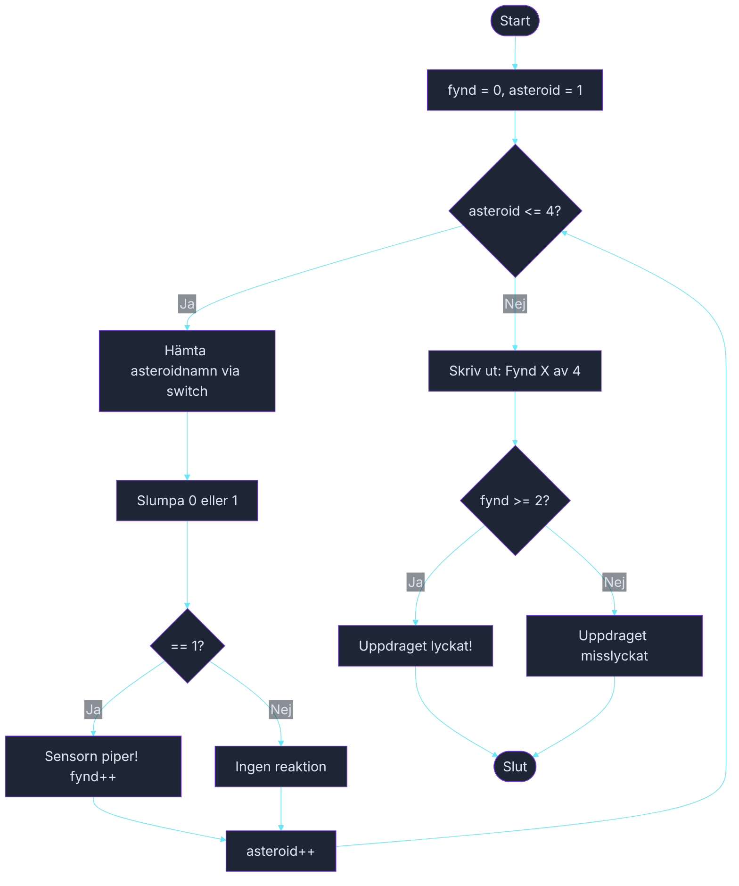

# Övning — Astro Naut

> 🗺️ **Rita ett flödesschema innan du kodar.** Skissa upp programflödet på papper — vilka steg tas? Vilka beslut fattas? Rita klart, lägg ner pennan, öppna sedan VS Code.

🟡

Rymdfararen Astro Naut skickas in i asteroidfältet CloudTwentySix för att leta efter sällsynta mineral. Fyra asteroider ska skannas i tur och ordning. På varje asteroid slumpar sensorn om det finns något värt att hämta. Programmet loopar igenom asteroiderna en i taget och rapporterar till basen. Om Astro hittar mineral på minst två: "Uppdraget lyckat — hemfärd godkänd!"

---

## Steg 1: Fyra asteroider, en loop

Loopa fyra gånger (1–4). Varje varv är en asteroid — använd en `switch` på loopvariabeln för att skriva ut asteroidens namn. Slumpa sedan om sensorn reagerar med `Random` (50 % chans). Räkna positiva fynd.

### Förväntad output (exempelkörning)
```plaintext
Asteroid 1 — CLO-Alpha: Ingen reaktion. Bara sten och damm.
Asteroid 2 — CLO-Beta: Sensorn piper! Astro hittar neonit-kristaller.
Asteroid 3 — CLO-Gamma: Ingen reaktion. Tomrum och tystnad.
Asteroid 4 — CLO-Delta: Sensorn piper! Astro hittar en kärna av cloudium.

Fynd: 2 av 4
Uppdraget lyckat — hemfärd godkänd!
```

## Steg 2: Variation i meddelandena

Lägg till lite liv — välj slumpmässigt bland två möjliga "ingen reaktion"-meningar och två möjliga mineralnamn med en extra `switch` (eller `if`).

## Tips

- `int asteroid = 1; asteroid <= 4; asteroid++`
- Asteroidnamn via `switch (asteroid) { case 1: namn = "CLO-Alpha"; ... }`
- `new Random().Next(2)` ger 0 eller 1

<details><summary>Flödesschema — förslag</summary>



<!-- mermaid: diagrams/astro_naut_1.mmd -->

</details>

<details><summary>Lösningsförslag</summary>

```csharp
Random slump = new Random();
int fynd = 0;

for (int asteroid = 1; asteroid <= 4; asteroid++)
{
    string namn = asteroid switch
    {
        1 => "CLO-Alpha",
        2 => "CLO-Beta",
        3 => "CLO-Gamma",
        4 => "CLO-Delta",
        _ => "Okänd"
    };

    bool reaktion = slump.Next(2) == 1;

    if (reaktion)
    {
        string mineral = slump.Next(2) == 0 ? "neonit-kristaller" : "en kärna av cloudium";
        Console.WriteLine($"Asteroid {asteroid} — {namn}: Sensorn piper! Astro hittar {mineral}.");
        fynd++;
    }
    else
    {
        string tystnad = slump.Next(2) == 0 ? "Bara sten och damm." : "Tomrum och tystnad.";
        Console.WriteLine($"Asteroid {asteroid} — {namn}: Ingen reaktion. {tystnad}");
    }
}

Console.WriteLine();
Console.WriteLine($"Fynd: {fynd} av 4");

if (fynd >= 2)
    Console.WriteLine("Uppdraget lyckat — hemfärd godkänd!");
else
    Console.WriteLine("För få fynd — uppdraget misslyckat.");
```

</details>
