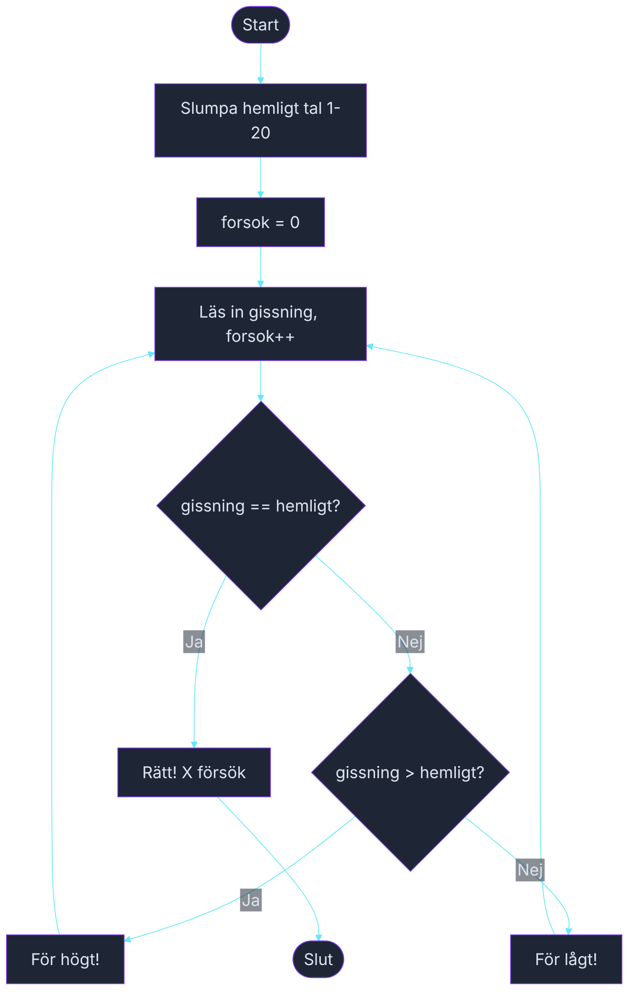

# Övning — Gissa talet

> 🗺️ **Rita ett flödesschema innan du kodar.** Skissa upp programflödet på papper — vilka steg tas? Vilka beslut fattas? Rita klart, lägg ner pennan, öppna sedan VS Code.

🟡

På rasten sitter Vera och Kim och spelar ett spel — en tänker på ett tal, den andra gissar. Det är kul men tröttsamt. Du bestämmer dig för att skriva en digital version: datorn tänker på ett tal mellan 1 och 20, du gissar tills du träffar.

---

## Steg 1: Slumpa ett tal och ta emot gissningar

Datorn slumpar ett hemligt tal med `Random`. Använd en `do-while`-loop som fortsätter tills gissningen är rätt. För varje fel gissning: skriv ut om svaret är för högt eller för lågt.

### Förväntad output (exempel — ditt tal varierar)
```plaintext
Gissa ett tal mellan 1 och 20!

Din gissning: 10
För högt!

Din gissning: 5
För lågt!

Din gissning: 7
För lågt!

Din gissning: 9
Rätt! Du klarade det på 4 försök.
```

## Steg 2: Vad händer om du gissar rätt på första försöket?

```plaintext
Gissa ett tal mellan 1 och 20!

Din gissning: 13
Rätt! Du klarade det på 1 försök.
```

Tänk på: "1 försök" — inte "1 försöks".

## Tips

- Slumpa med `int hemligt = new Random().Next(1, 21);` — Next(1, 21) ger 1–20.
- `do { ... } while (gissning != hemligt);` — kör minst en gång, fortsätter tills rätt.
- Räkna försök med `int forsok = 0;` och öka med `forsok++;` inne i loopen.

<details><summary>Flödesschema — förslag</summary>



<!-- mermaid: diagrams/gissa_talet_1.mmd -->

</details>

<details><summary>Lösningsförslag</summary>

```csharp
int hemligt = new Random().Next(1, 21);
int forsok = 0;
int gissning;

Console.WriteLine("Gissa ett tal mellan 1 och 20!");
Console.WriteLine();

do
{
    Console.Write("Din gissning: ");
    gissning = int.Parse(Console.ReadLine());
    forsok++;

    if (gissning > hemligt)
        Console.WriteLine("För högt!");
    else if (gissning < hemligt)
        Console.WriteLine("För lågt!");
    else
        Console.WriteLine($"Rätt! Du klarade det på {forsok} försök.");

    Console.WriteLine();
} while (gissning != hemligt);
```

</details>
