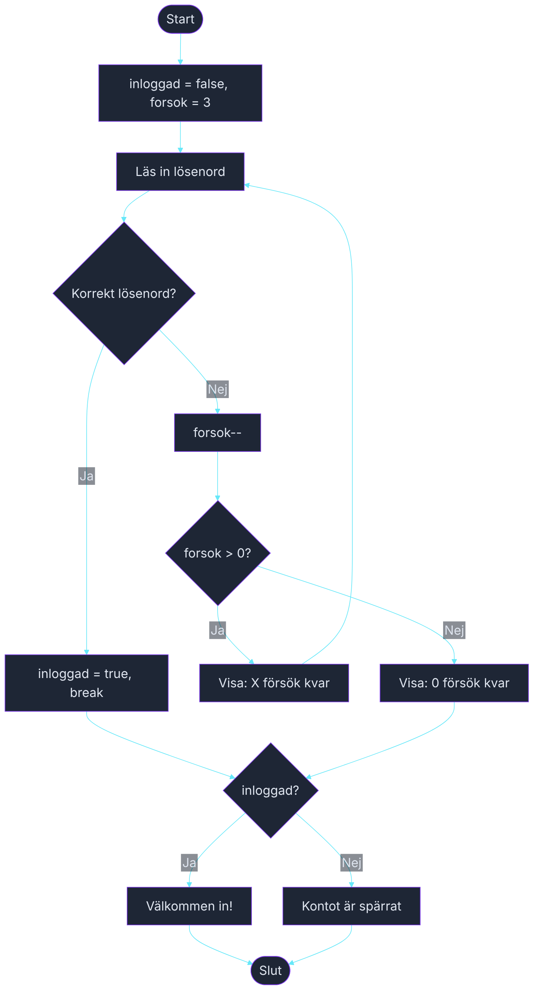

# Övning — Lösenordsförsöket

> 🗺️ **Rita ett flödesschema innan du kodar.** Skissa upp programflödet på papper — vilka steg tas? Vilka beslut fattas? Rita klart, lägg ner pennan, öppna sedan VS Code.

🟡

Spelklubben på Campus har ett hemligt forum där nästa LAN-spelkväll planeras. För att komma in måste man skriva rätt lösenord. Men alla har inte rätt — och tre felförsök spärrar kontot. Du bygger inloggningssystemet.

---

## Steg 1: Tre försök att logga in

Rätt lösenord är `kodord123`. Användaren får max 3 försök. Lyckas det inom tre försök: välkomna in. Tar försöken slut: spärra kontot.

Använd en `for`-loop som räknar försöken. Bryt ur loopen med `break` när rätt lösenord skrivits.

### Förväntad output — rätt på andra försöket
```plaintext
Ange lösenord: fel123
Fel lösenord. 2 försök kvar.

Ange lösenord: kodord123
Välkommen in!
```

### Förväntad output — alla försök felaktiga
```plaintext
Ange lösenord: abc
Fel lösenord. 2 försök kvar.

Ange lösenord: 123
Fel lösenord. 1 försök kvar.

Ange lösenord: hejsan
Fel lösenord. 0 försök kvar.
Kontot är spärrat.
```

## Steg 2: Rätt på första försöket

```plaintext
Ange lösenord: kodord123
Välkommen in!
```

Inga "försök kvar"-meddelanden behövs om man lyckas direkt.

## Tips

- `for (int i = 3; i > 0; i--)` ger nedräkning — `i` visar försök kvar.
- Använd `break` inuti `if (losenord == ratt)` för att hoppa ur loopen när rätt lösenord skrivits.
- En bool-flagga `bool inloggad = false;` gör det enkelt att kolla om man lyckades efter loopen.

<details><summary>Flödesschema — förslag</summary>



<!-- mermaid: diagrams/lossenordsforsoket_1.mmd -->

</details>

<details><summary>Lösningsförslag</summary>

```csharp
string ratt = "kodord123";
bool inloggad = false;

for (int forsok = 3; forsok > 0; forsok--)
{
    Console.Write("Ange lösenord: ");
    string inmatat = Console.ReadLine();

    if (inmatat == ratt)
    {
        inloggad = true;
        break;
    }

    Console.WriteLine($"Fel lösenord. {forsok - 1} försök kvar.");
    Console.WriteLine();
}

if (inloggad)
    Console.WriteLine("Välkommen in!");
else
    Console.WriteLine("Kontot är spärrat.");
```

</details>
