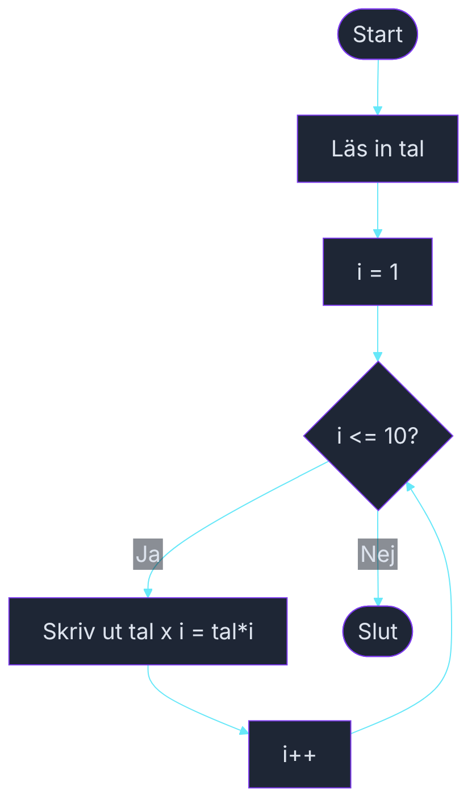

# Övning — Multiplikationstabellen

> 🗺️ **Rita ett flödesschema innan du kodar.** Skissa upp programflödet på papper — vilka steg tas? Vilka beslut fattas? Rita klart, lägg ner pennan, öppna sedan VS Code.

🟢

Lillebrodern Robin sitter och sliter med matteboken. Han förstår inte multiplikation och ber dig skriva ett program som skriver ut hela tabellen för ett valfritt tal, så han kan träna.

---

## Steg 1: Skriv ut multiplikationstabellen

Läs in ett heltal från användaren. Skriv sedan ut tabellen för det talet från 1 till 10 med en `for`-loop.

### Förväntad output (om användaren skriver 5)
```plaintext
Vilket tal vill du se tabellen för? 5

5 × 1 = 5
5 × 2 = 10
5 × 3 = 15
5 × 4 = 20
5 × 5 = 25
5 × 6 = 30
5 × 7 = 35
5 × 8 = 40
5 × 9 = 45
5 × 10 = 50
```

## Steg 2: Testa med ett annat tal

Kör programmet igen med talet 3. Stämmer det?

```plaintext
Vilket tal vill du se tabellen för? 3

3 × 1 = 3
3 × 2 = 6
3 × 3 = 9
3 × 4 = 12
3 × 5 = 15
3 × 6 = 18
3 × 7 = 21
3 × 8 = 24
3 × 9 = 27
3 × 10 = 30
```

## Tips

- En for-loop: `for (int i = 1; i <= 10; i++)` räknar från 1 till 10.
- Produkten beräknas inne i loopen: `int produkt = tal * i;`
- Skriv ut med `×`-tecknet i en interpolerad sträng: `$"{tal} × {i} = {produkt}"`

<details><summary>Flödesschema — förslag</summary>



<!-- mermaid: diagrams/multiplikationstabellen_1.mmd -->

</details>

<details><summary>Lösningsförslag</summary>

```csharp
Console.Write("Vilket tal vill du se tabellen för? ");
int tal = int.Parse(Console.ReadLine());
Console.WriteLine();

for (int i = 1; i <= 10; i++)
{
    int produkt = tal * i;
    Console.WriteLine($"{tal} × {i} = {produkt}");
}
```

</details>
