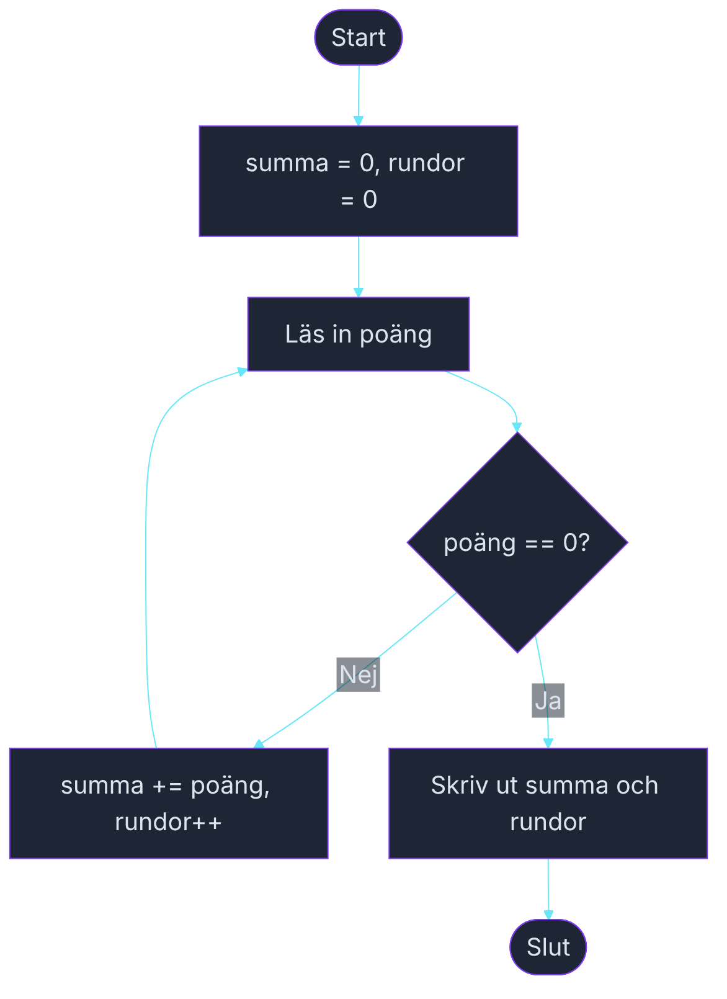

# Övning — Summera poäng

> 🗺️ **Rita ett flödesschema innan du kodar.** Skissa upp programflödet på papper — vilka steg tas? Vilka beslut fattas? Rita klart, lägg ner pennan, öppna sedan VS Code.

🟢

Fredag kväll, fyra kompisar spelar Yantzee runt köksbordet. Ni vill räkna ihop kvällens totalpoäng men ingen orkar hålla räkning i huvudet. Du skriver snabbt ett program: mata in poäng runda för runda, skriv 0 när spelet är slut.

---

## Steg 1: Samla in poäng med en while-loop

Läs in ett poängtal per runda. Loopen fortsätter tills användaren skriver 0. Räkna antalet rundor och summera poängen.

Inga variabler som håller alla rundors poäng — bara en summa och en räknare som uppdateras för varje runda.

### Förväntad output
```plaintext
Ange poäng för rundan (0 = avsluta): 22
Ange poäng för rundan (0 = avsluta): 18
Ange poäng för rundan (0 = avsluta): 31
Ange poäng för rundan (0 = avsluta): 14
Ange poäng för rundan (0 = avsluta): 0

Totalt: 85 poäng på 4 rundor.
```

## Steg 2: Testa med noll rundor

Vad händer om användaren direkt skriver 0? Skriver programmet något vettigt?

```plaintext
Ange poäng för rundan (0 = avsluta): 0

Totalt: 0 poäng på 0 rundor.
```

## Tips

- Deklarera `int summa = 0;` och `int rundor = 0;` innan loopen.
- Kontrollera inmatningen i `while`-villkoret: `while (poang != 0)`.
- Uppdatera `summa += poang;` och `rundor++;` inne i loopen.

<details><summary>Flödesschema — förslag</summary>



<!-- mermaid: diagrams/summera_poang_1.mmd -->

</details>

<details><summary>Lösningsförslag</summary>

```csharp
int summa = 0;
int rundor = 0;

Console.Write("Ange poäng för rundan (0 = avsluta): ");
int poang = int.Parse(Console.ReadLine());

while (poang != 0)
{
    summa += poang;
    rundor++;

    Console.Write("Ange poäng för rundan (0 = avsluta): ");
    poang = int.Parse(Console.ReadLine());
}

Console.WriteLine();
Console.WriteLine($"Totalt: {summa} poäng på {rundor} rundor.");
```

</details>
