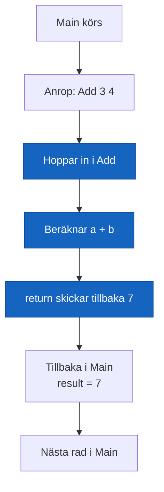

# Lästext — Metoder

## Varför metoder?

Program börjar ofta som en lång rad instruktioner i `Main`. Det fungerar — men inte länge. Så fort du behöver göra samma sak på flera ställen uppstår ett problem: du kopierar koden. Och varje kopia är ett ställe där ett framtida fel kan gömma sig.

En metod löser det. Du skriver logiken en gång, ger den ett namn, och anropar den var du behöver den. Vill du ändra beteendet? Du ändrar på ett enda ställe.

Det är DRY-principen i praktiken — **Don't Repeat Yourself**.

---

## Vad är en metod?

En metod är ett namngivet kodblock som utför en avgränsad uppgift. Den kan ta emot indata via **parametrar**, och den kan skicka tillbaka ett resultat via **return**.

```csharp
static void PrintGreeting(string name)
{
    Console.WriteLine("Hej, " + name + "!");
    Console.WriteLine("Välkommen till kursen.");
    Console.WriteLine("---");
}
```

Istället för att skriva de tre raderna om och om igen anropar du metoden:

```csharp
PrintGreeting("Anna");
PrintGreeting("Björn");
PrintGreeting("Camilla");
```

Tre rader istället för nio — och om du vill ändra hälsningsfrasen räcker det att ändra på ett ställe.

---

## Metodsignaturen

Allt innan klamrarna `{ }` kallas **signaturen** — metodens kontrakt mot omvärlden. Den talar om:

1. **Returtyp** — vad metoden skickar tillbaka (eller `void` om ingenting)
2. **Namn** — vad metoden heter
3. **Parameterlista** — vilka värden den tar emot och av vilken typ

```csharp
//  static   returtyp   namn       parameter
    static   int        Add     (int a, int b)
```

Koden inuti klamrarna är metodens **kropp** — det som faktiskt händer när du anropar den.

---

## void — gör något utan att returnera

Om metoden utför en uppgift men inte behöver skicka tillbaka något värde, använder du `void` som returtyp.

```csharp
static void PrintGreeting(string name)
{
    Console.WriteLine("Hej, " + name + "!");
}
```

Du anropar den, den kör koden, och sedan är det klart. Det finns inget värde att ta emot.

```csharp
PrintGreeting("Anna");   // kör metoden — inget värde tillbaka
```

Tänk på det som att trycka på en knapp — något händer, men du får inget i handen.

---

## Returvärde — när metoden beräknar något åt dig

Ibland vill du att metoden tar fram ett resultat som du kan använda vidare. Då anger du returtypen — till exempel `int`, `string` eller `bool` — istället för `void`.

```csharp
static int Add(int a, int b)
{
    return a + b;
}
```

Du tar emot resultatet i en variabel:

```csharp
int sum = Add(3, 4);
Console.WriteLine("Summan är: " + sum);   // Summan är: 7
```

Returtypen styr vilken typ variabeln på vänster sida måste ha. Returnerar metoden `int` — måste variabeln vara `int`.

---

## Parametrar och argument

**Parameter** är variabelnamnet i metoddefinitionen — den lokala variabeln som metoden tar emot.  
**Argument** är det faktiska värde du skickar in när du anropar metoden.

```csharp
static int Add(int a, int b)   // a och b är PARAMETRAR
{
    return a + b;
}

int result = Add(3, 4);        // 3 och 4 är ARGUMENT
```

Samma sak — vid två olika tidpunkter. Parameter när du *skriver* metoden. Argument när du *anropar* den.

Argumentet kan vara ett direkt värde, en variabel, eller ett uttryck:

```csharp
int x = 3;
int result = Add(x, x + 1);   // x och x+1 är argument
```

---

## return — avsluta och skicka tillbaka

Nyckelordet `return` gör två saker på en gång: det skickar tillbaka ett värde och avslutar metoden omedelbart.

```csharp
static int Add(int a, int b)
{
    return a + b;   // skickar tillbaka summan — metoden är klar
}
```

Kod som skrivs efter en `return`-sats i samma block körs aldrig. En metod med returtyp (inte `void`) måste alltid ha ett `return` — annars vägrar kompilatorn.

I en `void`-metod kan du använda `return;` utan värde för att avsluta tidigt:

```csharp
static void PrintPositive(int number)
{
    if (number <= 0)
        return;   // avsluta tidigt — skriv ingenting

    Console.WriteLine(number);
}
```

---

## Hur flödet fungerar

När programmet når ett metodanrop hoppar det in i metoden, kör koden där, och hoppar sedan tillbaka — till exakt raden efter anropet.



---

## static — en notering

Just nu i kursen skriver vi alla metoder med nyckelordet `static`. Det betyder att metoden tillhör klassen direkt — inte ett specifikt objekt. `Main` är också `static`, och en statisk metod kan anropa en annan statisk metod direkt.

```csharp
class Program
{
    static void Main(string[] args)
    {
        int result = Add(3, 4);
        Console.WriteLine(result);
    }

    static int Add(int a, int b)
    {
        return a + b;
    }
}
```

När du börjar jobba med klasser och objekt i nästa avsnitt kommer du förstå skillnaden bättre. Just nu: skriv `static` framför alla dina metoder.

---

## Bra metoder har ett bra namn

En metod som heter `DoStuff` berättar ingenting. En metod som heter `CalculateTotal` berättar exakt vad den gör — utan att du behöver läsa koden inuti.

Använd verb som beskriver vad metoden gör:

```csharp
static void PrintGreeting(string name) { ... }
static int  CalculateTotal(int price, int quantity) { ... }
static bool IsAdult(int age) { ... }
```

En bra namngivning gör koden läsbar. Det är en av de viktigaste sakerna du kan lära dig som programmerare.

**Se även:** [termer/metoder.md](../../termer/metoder.md) för en fullständig genomgång av alla begrepp.
