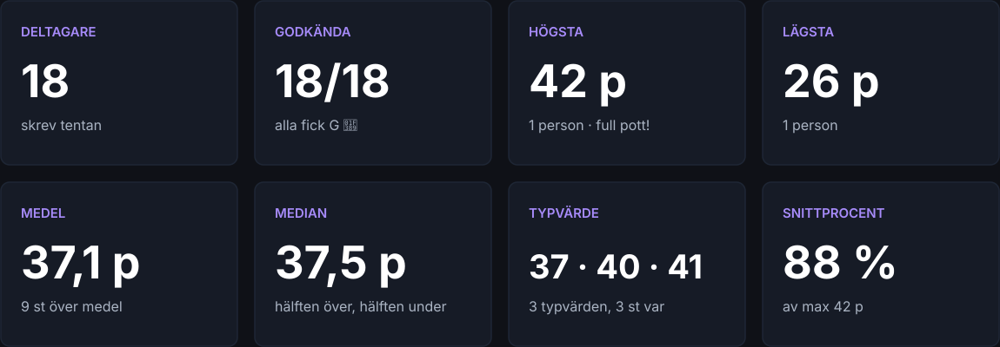
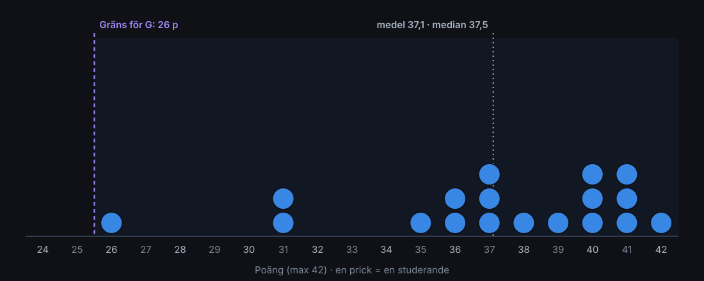
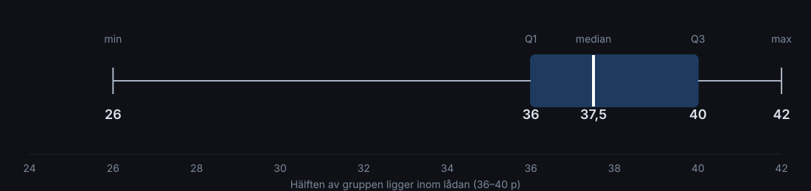
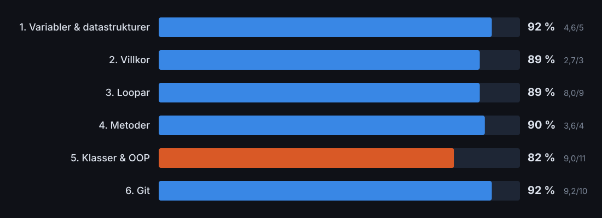
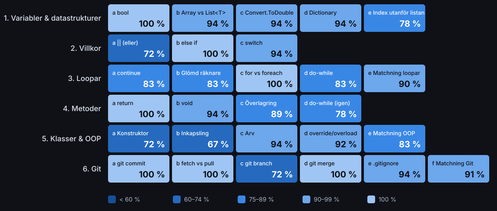
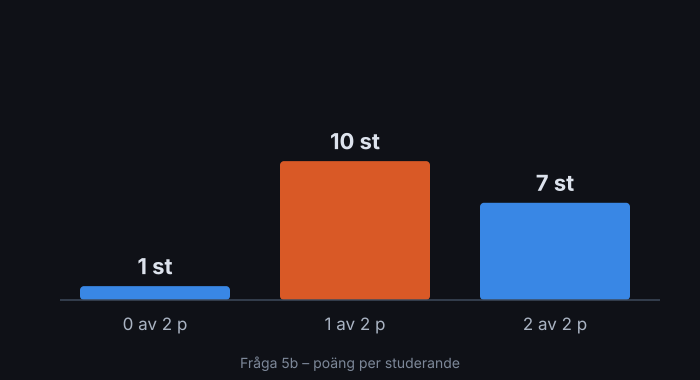

# Tentan i siffror
## Grundläggande OOP i C# · 30 september

*Hur gick det – för oss tillsammans?*

---

## Innan vi börjar

- Allt här är **sammanslaget för hela gruppen**: svenska och engelska tentan tillsammans
- Inga namn, inga individuella resultat
- Ditt eget resultat har du fått via mejl
- Tentan: **28 frågor**, **6 avsnitt**, **max 42 poäng**, G från **26 poäng** (60 %)

---

## Nyckeltal



---

## Poängspridning



*Alla prickar ligger till höger om G-gränsen. Alla.*

---

## Lådagram – hur tätt ligger vi?



- **Q1** = 36 p: en fjärdedel ligger under
- **Q3** = 40 p: en fjärdedel ligger över
- **Kvartilavstånd** (Q3 − Q1) = **4 poäng**: mittenhalvan av gruppen ligger inom 4 poäng

---

## Per avsnitt



*OOP är det avsnitt som fick lägst snittresultat, och det är också det svåraste avsnittet i kursen. Det är helt i sin ordning.*

---

## Värmekarta – alla 28 frågor



---

## 🏆 De lättaste frågorna – 100 % rätt

**Sju frågor** klarade *alla* 18:

| Avsnitt | Fråga |
|---|---|
| Variabler | 1a – Vad lagrar en `bool`? |
| Villkor | 2b – Vad gör `else if`? |
| Loopar | 3c – Skillnaden mellan `for` och `foreach` |
| Metoder | 4a – Vad gör `return`? |
| Git | 6a `git commit` · 6b `fetch` vs `pull` · 6d `git merge` |

*Tre av sju är Git-frågor. Ni har koll på er versionshantering!*

---

## 🧗 Den svåraste frågan – 5b Inkapsling (67 %)



**"Vad betyder inkapsling?"**
*(mer än ett svar är rätt)*

**10 av 18 fick 1 av 2 poäng.** De hittade ett av de rätta påståendena, men inte båda.

7 fick full pott.

*Det var alltså inte att ni inte kunde inkapsling. Det var halva bilden som saknades.*

---

## Inkapsling – klassen bestämmer vem som rör datan

✅ **Samla data och metoderna som jobbar med datan i en enhet** (klassen)
✅ **Dölja de interna detaljerna och bara visa ett publikt gränssnitt**

```csharp
public class Konto
{
    private decimal _saldo;                 // dolt utifrån
    public decimal Saldo => _saldo;         // kontrollerad läsning
    public void SättIn(decimal b) { if (b > 0) _saldo += b; } // kontrollerad ändring
}
```


---

## 🥈 Delad andraplats i svårighet – 72 %

| Fråga | Rätt svar |
|---|---|
| **2a** – Vad gör `\|\|`? | `true` om **minst en** av sidorna är `true` |
| **5a** – Vad är en konstruktor? | Anropas **automatiskt** när ett objekt skapas med `new` |
| **6c** – Vad gör `git branch`? | **Listar, skapar eller tar bort** grenar |

*Titta extra på de här tre inför nästa kurs, de kommer tillbaka.*

---

## 🤓 Kuriosa

- **Samma fråga två gånger:** `do-while` dök upp i både 3d och 4d. Det blev **83 %** första gången och **78 %** andra gången 🤔
- **Fetch vs pull** (en klassisk "svår" Git-fråga): **100 %**. Men `git branch`: 72 %
- Gruppen samlade tillsammans **668 av 756** möjliga poäng
- De tre matchningsfrågorna (5 p styck) gav **83–91 %**. Ni kan kopplingarna mellan begreppen.

---

## 🧮 Nördhörnan

| Mått | Värde | Vad betyder det? |
|---|---|---|
| Standardavvikelse | **4,1 p** | Typiskt avstånd från medel |
| Variationsbredd | **16 p** | Högsta − lägsta |
| Kvartilavstånd | **4 p** | Mittenhalvans bredd |
| Skevhet | **−1,18** | Vänstersned fördelning |

**Vänstersned?** De flesta ligger högt, och "svansen" pekar mot lägre poäng.
Därför är **medel (37,1) < median (37,5)**: de få lägre resultaten drar ner medelvärdet mer än medianen.

Bonus: gruppen har **tre typvärden**, 37, 40 och 41 poäng, med 3 personer var.

---

## Sammanfattning

- ✅ **18 av 18 godkända**
- ✅ Snitt **88 %**, starkast på **variabler** och **Git** (92 %)
- ✅ En person fick **full pott**
- 🔁 Repetera: **inkapsling**, **konstruktorer** och **`||`**
- ➡️ Nästa kurs bygger vidare på OOP, och där kommer inkapsling att sitta i ryggmärgen

**Bra jobbat allihop!** 💜
