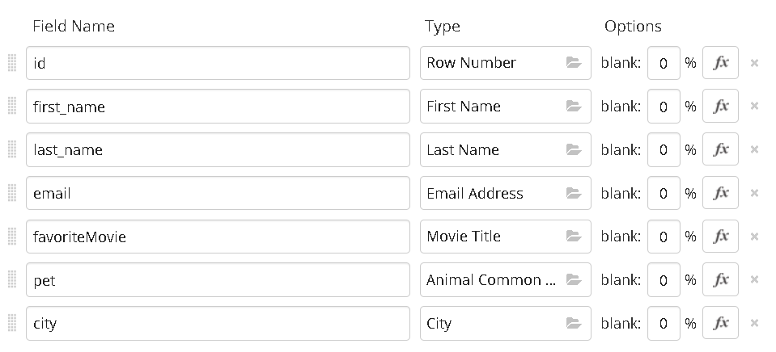
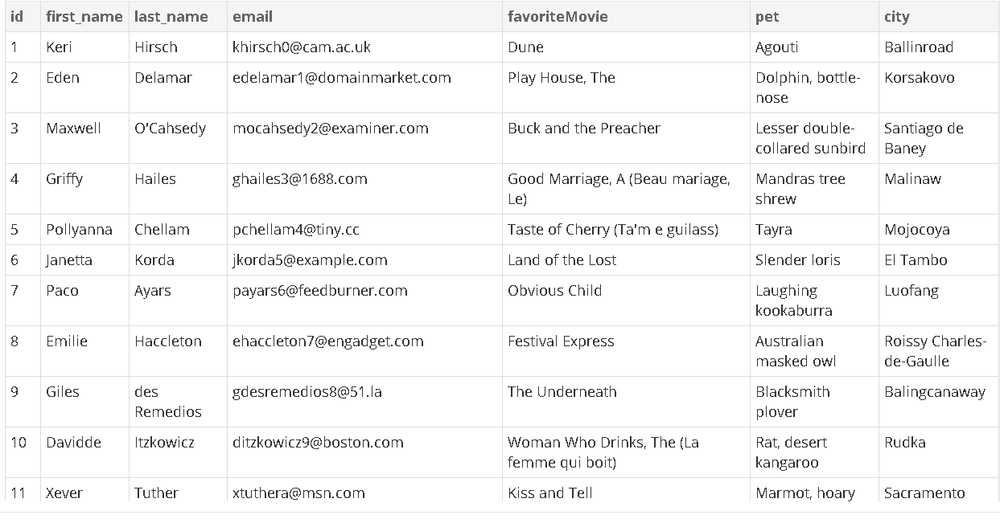

# C# + SQL Övningar

🟡

Följande uppgifter kräver en del tänkande och kodande, så jag föreslår att ni gör dem i era grupper. Vi tittar på resultatet tillsammans på torsdag.

Här nedan följer några uppgifter för att lektionen ska smälta in lite mer.

Hälsningar
Marcus

> Uppgifterna använder SQLite och NuGet-paketet `Microsoft.Data.Sqlite`. Har du inte gjort det förut, läs [SQLite i C#](../examples/2026-10-07_sqlite_i_csharp.md) först. Där står hur du skapar projektet och installerar paketet.

## Uppgift 1 — Skapa klassen DatabaseHandler

För att det ska vara enkelt att arbeta med databasen skapar vi en klass som vi kallar `DatabaseHandler`.

I den samlar vi alla metoder vi kan behöva för att använda databasen. En bra programmerare är en lat programmerare: slipper man skriva om kod sparar man sig själv en massa tid.

Det är alltid bra att ha en klass som hanterar all kommunikation med databasen, för då slipper man upprepa koden. Precis som när vi normaliserar (förenklar och delar upp) en databas förenklar vi vår kod: en klass tar hand om allt som har med databasen att göra.

> One class to rule them all

1. Skapa en konsolapplikation som heter `SQLite_Ovningar` och lägg till NuGet-paketet `Microsoft.Data.Sqlite`.
2. Skapa klassen `DatabaseHandler` i en egen fil, `DatabaseHandler.cs`.
3. Skapa en property som heter `ConnectionString`.
4. Skapa en property som heter `DatabaseName`.
5. Ge `ConnectionString` värdet `"Data Source={0}"`, antingen i konstruktorn eller som propertyns standardvärde. Ge `DatabaseName` ett filnamn, till exempel `"Population.db"`.

Den här klassen är grunden för resten av övningarna.

## Uppgift 2 — Metoder för att skicka och ta emot information

Nu skapar vi metoder för att använda databasen. I [rymdmangan](../notes/sql_fran_csharp_rymdmanga.md) såg vi att det finns två sätt att kommunicera med databasen:

- **Piratmetoden:** `ExecuteNonQuery()` kör SQL-koden och returnerar en `int` med antalet påverkade rader.
- **Handlarmetoden:** `ExecuteReader()` hämtar rader från databasen, och med `dt.Load(reader)` hamnar de i ett `DataTable`-objekt.

1. Skapa en metod (till exempel `ExecuteSQL`) som tar emot en SQL-sträng och parametrar och kör SQL-koden med `ExecuteNonQuery`. Låt metoden returnera antalet påverkade rader.
2. Skapa en metod (till exempel `GetDataTable`) som tar emot en SQL-sträng och parametrar, kör SQL-koden och returnerar en `DataTable`.

> **Tips:** parametrarna kan du skicka in som en `Dictionary<string, object>`, där nyckeln är parameterns namn (till exempel `"$age"`) och värdet är det som ska in:
>
> ```csharp
> public int ExecuteSQL(string sql, Dictionary<string, object>? parameters = null)
> ```
>
> Loopa igenom den och anropa `cmd.Parameters.AddWithValue(...)` för varje par.

Metoderna som pratar med databasen ska använda `ConnectionString`-propertyn. Då vet vi att alla metoder kopplar sig till samma databas.

När du ska använda din connection string, skriv till exempel:

```csharp
var conString = string.Format(ConnectionString, DatabaseName);
```

Det fungerar på samma sätt som när man skriver:

```csharp
Console.WriteLine("Hälsningsfras: {0}", "Hej");
```

`string.Format` ersätter `{0}` i din `ConnectionString` med databasens namn, så slipper du bråka med strängen.

Använd sedan `conString` när du skapar din `SqliteConnection`.

## Uppgift 3 — Testkörning

Nu har vi metoder för att kommunicera med databasen. Då testar vi dem.

I `Program.cs`:

1. Skapa en instans av din `DatabaseHandler`.
2. Ställ in `DatabaseName` så att den använder `Population.db`, databasen med tabellen `WeirdPeople` från [Mer sökningar](mer_sokningar.md).
3. Använd dina metoder för att hämta en lista på personer som är över 30 och under 50 år.
4. Skriv ut listan i konsolen.

## Uppgift 4 — Gräva lite i systemet

En SQLite-databas är en enda fil. Men var ligger den egentligen när programmet körs?

SQLite kan berätta det själv. Kommandot `PRAGMA` är SQLites sätt att fråga databasen om information om sig själv.

1. Använd din `DatabaseHandler` och kör: `PRAGMA database_list;`
2. Skriv ut resultatet i konsolen. Kolumnen `file` innehåller hela sökvägen till databasfilen.
3. Skapa en metod i din klass som returnerar sökvägen.

Nu vet du var filen finns, ifall du skulle behöva ta en backup av din databas. Det räcker faktiskt att kopiera filen (när ingen använder den).

## Uppgift 5 — Lite planering vore inte helt fel

På Mockaroo skapar vi en lista som vi laddar ner som CSV, så att vi kan hantera alla `INSERT` själva. Men den här tabellen kommer att innehålla många upprepade värden.



Vad är ett bra sätt att dela upp den? Diskutera gärna i grupp hur en sådan här tabell skulle kunna delas upp så att databasen blir så liten som möjligt.



- Hur många tabeller blir det ungefär?
- Behöver alla en Primary Key?
- Rita gärna ett diagram med data.
- Blir alla kopplingar 1–1?
- Behövs en kopplingstabell (relationstabell)?

## Uppgift 6 — Gräva lite mer i systemet

Vi fortsätter att använda databasklassen för nästa fråga.

Nu vill vi veta vilka tabeller som finns i databasen. SQLite håller reda på det i en egen systemtabell som heter `sqlite_master`.

1. Fråga databasklassen: `SELECT name FROM sqlite_master WHERE type = 'table';`
2. Skriv ut listan i konsolen.
3. Skapa en metod i databasklassen som hämtar listan.

Nu vet du hur du tar reda på vilka tabeller som finns i en databas.

> Ser du en tabell som heter `sqlite_sequence` som du inte har skapat? Den skapar SQLite själv för att hålla reda på `AUTOINCREMENT`-räknarna.

## Uppgift 7 — Skapa en databas

Nu ska vi skapa databaser från koden.

I SQLite är en databas en fil, och det finns inget `CREATE DATABASE`. Databasen skapas automatiskt första gången du öppnar en koppling till ett filnamn som inte finns.

`CREATE TABLE` är lite krångligare. Man skriver tabellens namn och sedan en parentes. I parentesen anger man kolumnernas namn och typer, och efter dem de regler som gäller.

```sql
Id INTEGER PRIMARY KEY AUTOINCREMENT,   -- Primary Key som räknas upp automatiskt
kolumnnamn TEXT NOT NULL,                -- värde som inte får vara null
kolumnnamn TEXT UNIQUE,                  -- värde som måste vara unikt
FOREIGN KEY (kolumn) REFERENCES tabell (tabellensId)  -- koppling till en annan tabell
```

1. Byt `DatabaseName` till `Humans.db`. Databasen skapas så fort du kör din första fråga mot den.
2. Använd din databasklass för att skapa en ny tabell som heter `People`:

   ```sql
   CREATE TABLE People (
       Id        INTEGER PRIMARY KEY AUTOINCREMENT,
       lastName  TEXT,
       firstName TEXT,
       address   TEXT,
       city      TEXT,
       shoeSize  INTEGER
   );
   ```

3. Lägg till kolumnen `age` i tabellen:

   ```sql
   ALTER TABLE People ADD COLUMN age INTEGER;
   ```

4. Ta bort kolumnen `shoeSize`:

   ```sql
   ALTER TABLE People DROP COLUMN shoeSize;
   ```

5. För framtida bruk, skapa metoder i din databasklass som tar emot parametrar:
   1. `CreateTable(string table, string fields)`
   2. `AlterTable(string table, string field)`
   3. `DropTable(string table)`
   4. `DropDatabase()`, som raderar databasfilen. Anropa `SqliteConnection.ClearAllPools()` innan `File.Delete(...)`, annars är filen låst.

> **Varning:** tabell- och kolumnnamn kan inte skickas som SQL-parametrar. De måste byggas in i strängen. Använd därför bara de här metoderna med namn som *du* har skrivit i koden, aldrig med något som användaren har matat in. Annars öppnar du för SQL injection.

## Uppgift 8 — Testdata!

Nu behöver vi testdata, och då tar vi en runda till Mockaroo.

Skapa data som passar tabellen `People` och lägg in den i `Humans.db`.

## Uppgift 9 — Klasser och SQL

1. Skapa en klass som heter `Person`.
2. Ge den properties för `Id`, `LastName`, `FirstName`, `Address`, `City` och `Age`.
3. Skapa en klass som heter `PeopleHandler`.
4. I `PeopleHandler` skapar du CRUD-metoder som hanterar `Person`-objekt, till exempel:

   ```csharp
   public void Create(Person person)
   public Person? Read(string name)
   public void Update(Person person)
   public void Delete(Person person)
   ```

   Metoderna ska ta emot ett `Person`-objekt och lägga in dess värden i SQL-koden som parametrar för att spara, söka, uppdatera eller radera i tabellen `People`. `Read` ska returnera ett `Person`-objekt, eller `null` om ingen hittas.

5. Skapa en metod `List()` som returnerar alla personer.
6. Testa de olika metoderna.
7. Skriv ut resultatet i konsolen.

> **Tips:** [Lastmanifestet](../notes/sqlite_lastmanifestet.md) visar hur man skickar ett objekt till databasen och får tillbaka en lista med objekt.

### SQLites datatyper och hur du läser dem i C#

SQLite har bara fem lagringsklasser. Det gör det enkelt:

| SQLite | C# | Läs med |
|---|---|---|
| `INTEGER` | `long` (eller `int`) | `GetInt64` / `GetInt32` |
| `REAL` | `double` | `GetDouble` |
| `TEXT` | `string` | `GetString` |
| `BLOB` | `byte[]` | `GetFieldValue<byte[]>` |
| `NULL` | `null` | kontrollera med `IsDBNull` |

Datum finns inte som egen typ i SQLite. De sparas oftast som `TEXT` (till exempel `"2026-10-07"`) och läses med `GetDateTime`.

Källa: [Data types – Microsoft.Data.Sqlite](https://learn.microsoft.com/en-us/dotnet/standard/data/sqlite/types)

## Lärdomar

Nu har du en klass som hanterar kommunikationen med databasen. Den kan du återanvända, så slipper du skriva om koden.

I övningarna har du lärt dig:

- hur man skapar och tar bort databaser
- hur man skapar, ändrar och tar bort tabeller och kolumner
- hur man läser från en `DataTable` och sparar värdet i en property
- hur man läser properties och gör om dem till SQL-parametrar
- CRUD-metoder

Har du fått ordning på allt det här har du allt du behöver för de kommande inlämningarna 😉

Huvudsaken är att du nu kan kommunicera med databasen via din klass. Då slipper du hantera databasen överallt i koden och kan fokusera på C#.
