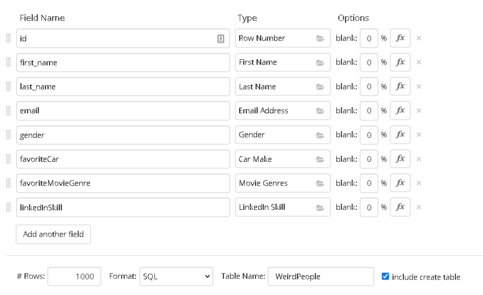

# Mer sökningar

🟡

Nu ska vi leka CSI med en databas full av påhittade personer. Först genererar vi datan, sedan ställer vi frågor till den.

## 1. Skapa testdata på Mockaroo

Gå in på [mockaroo.com](https://www.mockaroo.com/) och skapa en tabell med de här fälten:



| Field Name | Type |
|---|---|
| `id` | Row Number |
| `first_name` | First Name |
| `last_name` | Last Name |
| `email` | Email Address |
| `gender` | Gender |
| `favoriteCar` | Car Make |
| `favoriteMovieGenre` | Movie Genres |
| `linkedInSkill` | LinkedIn Skill |

Längst ner:

- **Format:** välj `SQL`.
- **Table Name:** skriv `WeirdPeople`.
- Kryssa i **Include create table**.

Ladda ner filen genom att klicka på **Download Data**. Känner du dig äventyrlig kan du klicka flera gånger, så får du fler filer och fler personer.

## 2. Skapa databasen

Öppna DB Browser for SQLite och klicka på **New Database**. Kalla den `Population.db`, om du inte redan har en sådan.

## 3. Läs in personerna

Öppna filen du laddade ner i en texteditor (till exempel Notepad eller VS Code), kopiera allt och klistra in det i fliken **Execute SQL**. Kör koden.

Om du har laddat ner flera filer kör du dem en i taget. Ta bort `create table`-delen i alla filer utom den första. Tabellen finns ju redan, och då klagar databasen.

Glöm inte att klicka på **Write Changes** när du är klar.

## 4. Ge alla en ålder

Mockaroo gav oss ingen ålder, så vi lägger till en kolumn:

```sql
ALTER TABLE WeirdPeople ADD COLUMN age INTEGER;
```

Ge sedan alla en slumpad ålder mellan 0 och 99:

```sql
UPDATE WeirdPeople SET age = ABS(RANDOM()) % 100;
```

`RANDOM()` ger ett slumptal (som kan vara negativt), `ABS` tar bort minustecknet och `% 100` ger resten vid division med 100, alltså ett tal mellan 0 och 99. Varje rad får sitt eget slumptal.

> **SQL Server:** där skriver man `UPDATE WeirdPeople SET age = ABS(CHECKSUM(NEWID())) % 100;`

## 5. CSI

Använd SQL för att svara på frågorna. Diskutera gärna i grupp.

1. Vi rensar lite i databasen först. Radera alla personer som är yngre än 15 år.
2. Hur många personer tycker om skräckfilmer?
3. Hur många personer som är över 18 men under 25 år kan Karate?
4. Hur många personer över 25 år kan Karate?
5. Hur många män mellan 25 och 32 år tycker om Ford?
6. Hur många som identifierar sig som kvinnor tycker om skräckfilmer?
7. Hur många personer mellan 35 och 42 år har ett efternamn som börjar på S?
   - Hur många av dem identifierar sig som män?
   - Och av dessa män, hur många är över 50 år?
8. Hur många under 18 år tycker om både actionfilmer och BMW?
9. Hur många personer tycker om Subaru?
   - Är det mest äldre eller yngre personer?
10. Hur många personer har ett Gmail-konto?
11. Hur många personer finns i din databas?
    - Hur många unika förnamn finns det?
    - Hur många unika efternamn finns det?
    - Hur många unika kombinationer av för- och efternamn finns det?

> **Tips:** en person kan gilla flera filmgenrer, till exempel `Horror|Thriller`. Använd `LIKE` för att hitta en genre någonstans i texten:
>
> ```sql
> SELECT COUNT(*) FROM WeirdPeople WHERE favoriteMovieGenre LIKE '%Horror%';
> ```

> **Tips:** `SELECT DISTINCT` tar bort dubbletter ur resultatet:
>
> ```sql
> SELECT DISTINCT first_name FROM WeirdPeople;
> ```

Fler frågor kommer sen 😉

---
Det här är grunden. Öva på den, lek med koden, gör misstag. Det är så du lär dig.
